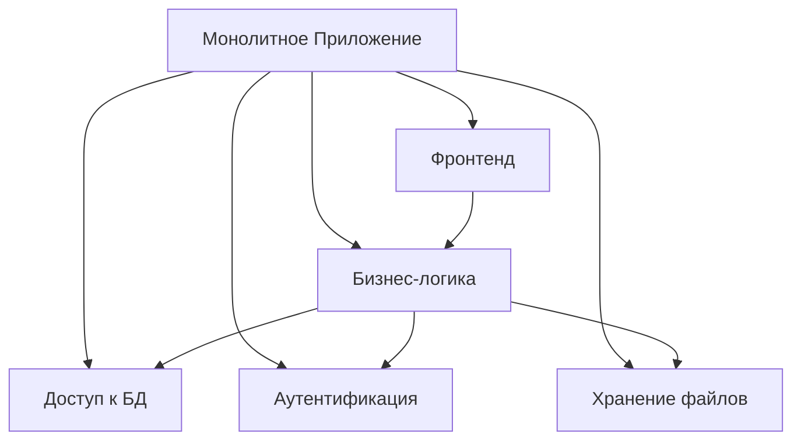
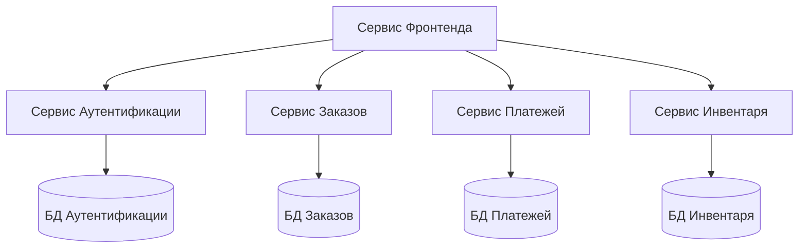

# Эволюция системной архитектуры: от монолитов к микросервисам

В постоянно развивающемся ландшафте разработки программного обеспечения одним из самых важных архитектурных решений, с которыми сталкиваются команды, является выбор между монолитной и микросервисной архитектурами. Эта статья исследует увлекательное путешествие системной архитектуры и объясняет, почему выбор между этими подходами более сложен, чем может показаться на первый взгляд.

## Традиционный монолит

На протяжении десятилетий монолитная архитектура была стандартом де-факто для создания приложений. В этом подходе все компоненты приложения тесно связаны и работают как единый сервис. Представьте это как массивную, самодостаточную единицу, где вся функциональность существует вместе.

## Появление микросервисов

Микросервисная архитектура возникла как ответ на ограничения монолитных систем. Вместо одного большого приложения система разбивается на меньшие, независимые сервисы, которые общаются через четко определенные API.

## Скрытая сложность

Хотя микросервисы предлагают несколько преимуществ, таких как масштабируемость и независимое развертывание, они вносят новый уровень сложности, который многие команды недооценивают:

1. **Сложности распределенных систем**: Сервисы должны корректно обрабатывать сетевые сбои, задержки и частичные отказы системы.
2. **Согласованность данных**: Поддержание согласованности данных между несколькими базами данных становится серьезной проблемой.
3. **Операционные накладные расходы**: Управление несколькими сервисами требует более сложных стратегий мониторинга, логирования и развертывания.

## Современный гибридный подход

Сегодня многие организации принимают гибридный подход, где они:
- Сохраняют основную бизнес-логику в монолитном приложении
- Выделяют конкретные сервисы, требующие независимого масштабирования
- Используют событийно-ориентированную архитектуру для коммуникации между сервисами

Этот подход позволяет командам получать преимущества обоих миров, минимизируя недостатки.

## Будущее системной архитектуры

Глядя в будущее, несколько трендов формируют системную архитектуру:

1. **Бессерверные вычисления**: Переход к моделям function-as-a-service
2. **Периферийные вычисления**: Обработка данных ближе к месту их генерации
3. **AI-управляемая архитектура**: Использование машинного обучения для оптимизации системного дизайна

## Заключение

Выбор между монолитной и микросервисной архитектурой не связан со следованием трендам — он связан с пониманием ваших конкретных потребностей и ограничений. Лучшая архитектура — это та, которая решает ваши проблемы, оставаясь при этом поддерживаемой и масштабируемой.

Помните: Архитектурные решения должны определяться бизнес-требованиями, а не последними модными словами в технологической индустрии. 