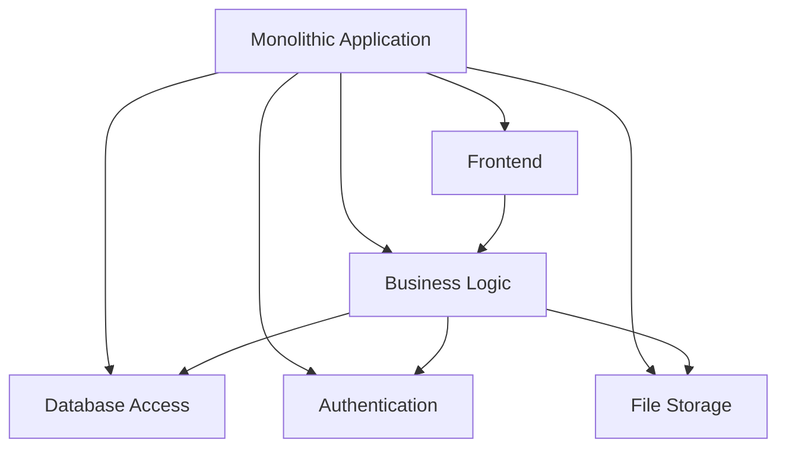
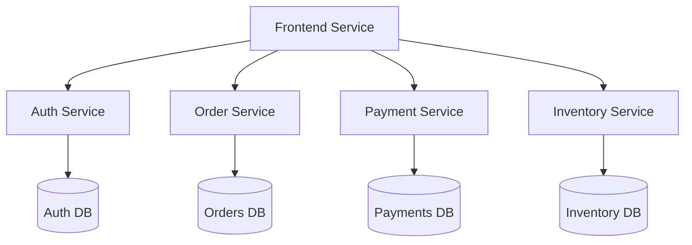

# The Evolution of System Architecture: From Monoliths to Microservices

In the ever-evolving landscape of software development, one of the most significant architectural decisions teams face is choosing between monolithic and microservices architectures. This article explores the fascinating journey of system architecture and why the choice between these approaches is more nuanced than it might seem.

## The Traditional Monolith

For decades, monolithic architecture was the de facto standard for building applications. In this approach, all components of an application are tightly coupled and run as a single service. Think of it as a massive, self-contained unit where all the functionality lives together.

## The Rise of Microservices

The microservices architecture emerged as a response to the limitations of monolithic systems. Instead of one large application, the system is broken down into smaller, independent services that communicate through well-defined APIs.

## The Hidden Complexity

While microservices offer several advantages like scalability and independent deployment, they introduce a new layer of complexity that many teams underestimate:

1. **Distributed Systems Challenges**: Services need to handle network failures, latency, and partial system failures gracefully.
2. **Data Consistency**: Maintaining data consistency across multiple databases becomes a significant challenge.
3. **Operational Overhead**: Managing multiple services requires more sophisticated monitoring, logging, and deployment strategies.

## The Modern Hybrid Approach

Today, many organizations are adopting a hybrid approach, where they:
- Keep core business logic in a monolithic application
- Extract specific services that need independent scaling
- Use event-driven architecture for communication between services

This approach allows teams to reap the benefits of both worlds while minimizing the drawbacks.

## The Future of System Architecture

As we look to the future, several trends are shaping system architecture:

1. **Serverless Computing**: Moving towards function-as-a-service models
2. **Edge Computing**: Processing data closer to where it's generated
3. **AI-Driven Architecture**: Using machine learning to optimize system design

## Conclusion

The choice between monolithic and microservices architecture isn't about following trends—it's about understanding your specific needs and constraints. The best architecture is the one that solves your problems while remaining maintainable and scalable.

Remember: Architecture decisions should be driven by business requirements, not by the latest buzzwords in the tech industry. 